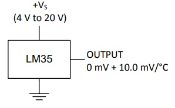
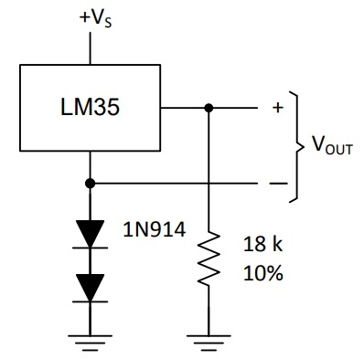

<script type="text/javascript" charset="utf-8" 
src="https://cdn.mathjax.org/mathjax/latest/MathJax.js?config=TeX-AMS-MML_HTMLorMML,
https://vincenttam.github.io/javascripts/MathJaxLocal.js"></script>

# LM35
---

## Problema
---
El primero de los sensores de temperatura que vamos a analizar es el LM35, un tipo de sensor de estado solido integrado. Es bastante sencillo de utilizar, su respuesta es como esta:



Noten que entrega 10 mV por cada grado centígrado, dando una respuesta bastante lineal y fácil de medir. El problema se presenta al querer medir temperaturas por debajo de cero, porque eso involucraría tensiones negativas que no podemos poner en un pin de un microcontrolador para medir. Ante ese problema, los mismos fabricantes en la [hoja de datos](https://www.ti.com/lit/ds/symlink/lm35.pdf) nos presentan esta solución:



Noten que ahora hay dos tensiones para medir, una 'positiva' y una 'negativa'. Si medimos ambas tensiones con el microcontrolador y hacemos la diferencia entre ellas (V+ - V-), el resultado es la tensión que representa la temperatura que estamos buscando, y nos evitamos el tener que medir directamente una tensión negativa. Esta configuración nos va a permitir medir el rango completo del sensor, que es desde -55 a 150 grados centígrados.

El objetivo de este problema, es usar esta configuración para poder medir la temperatura que indique el sensor y poder mostrarla en un display LCD.

## Donde empezar
---
Dentro de la carpeta `pset1/lm35` clonen la rama `pset1/lm35` del repositorio `ise5` donde van a encontrarse con las bases del algoritmo que van a tener que desarrollar. Para clonarlo, escriban en la terminal:

```
git clone -b pset1/lm35 https://github.com/trq20/ise5.git
```

 Dentro de `main.cpp` es donde van a empezar a trabajar. Hay una carpeta con un par de librerías, pero eso lo veremos mas adelante.

## Entendiendo el programa
---
Van a ver que el `main.cpp` está bastante vacío, solo tiene un par de librerías incluidas y continúa inmediatamente a la función principal. Solo algunas aclaraciones respecto a la estructura:
- Noten el `while(1)`, es un bucle infinito, por lo que todo lo que escriban dentro, va a estar ejecutándose una y otra vez (similar al `loop` de Arduino).
- Desde que inicia la función `main` hasta el bucle, lo que escriban va a ejecutarse solo una vez, por lo que es un buen lugar para declaración de variables o inicialización de pines.

## Circuito y simulación
---
El circuito van a tener que diseñarlo y simularlo en Proteus. Pueden ir [acá](../../../guides/proteus8/) para ver como instalarlo y las bases de como usarlo.

Los componentes que van a necesitar mínimamente son:
- ATmega328P.
- Diodo 1N914 x 2.
- LM35.
- Resistencia de 18K.
- LCD 16x2 (aparece en la librería de Proteus con el nombre LM016L).

Son libres de decidir que pines del microcontrolador usar. Algunas aclaraciones:

- Sobre el LCD:
  - `VDD` y `VEE` van a `5V`.
  - `VSS` y `RW` van a `GND`.
  - `D0-D3` no se conectan.
  - `RS`, `E`, `D4-D7` van al microcontrolador en el orden que prefieran.
- El LM35 tiene que estar configurado como en el primer apartado.
- Recuerden que los pines analógicos son `PC0-PC6`.
- Los pines `AVCC` y `RESET` del microcontrolador deben ir a `5V`.

Una vez que tengan el circuito armado y el programa compilado, tienen que hacer doble click en el microcontrolador o click derecho y propiedades y en *Program file* cargar el `.hex` que obtuvieron al compilar. Una vez que esto lo tengan, simulan el circuito dando inicio con el botón que está en la esquina inferior izquierda.

## Especificaciones
---
- El algoritmo que desarrollen tiene que ser capaz de mostrar la temperatura que indique el LM35 en un LCD con dos decimales de precisión.
- El programa debe mostrar las temperaturas en un rango de -55 a 150 grados con la mayor exactitud posible.

## Orientación
---

- Pueden mirar esta [página](../../../guides/libraries/) para entender mejor como funcionan las librerías y que funciones pueden usar.  
- Recuerden que el valor que reciban de la función `analogRead` es un número entero que es proporcional a la temperatura, pero necesita que le hagan una conversión. Pueden pensarlo así:

```c
uint16_t val = analogRead(0);		// Devuelve un numero entre 0 y 1023
float tension = (float)val * REF / 1023;	// Valor de tension que en el pin
float temp = tension * 100;  // Valor de temperatura que mide el LM35
```

Esto puede hacerse de forma mas compacta, pero la idea es que tenemos que hacer la lectura, luego convertirla a tensión con la relación de la segunda linea (donde `REF` es el valor de tensión de referencia que elegimos). Este paso es indistinto para el sensor que estemos usando, mientras que el último paso es convertir el valor de tensión que entrega el sensor a la magnitud que nos interesa (en este caso temperatura) y ahí dependeremos de como se comporte cada sensor. En nuestro caso, esa cuenta sale de pensar:

$$
V_{out} = 10 \frac{mV}{C} \space x \space T\space[C]
$$

$$
T\space[C] = \frac{V_{out}}{10\frac{mV}{C}} = 100\space x \space V_{out}
$$

- Recuerden que pueden fijar una tensión de referencia mas apropiada para mejorar la precisión de la medición si arman un divisor de tensión y conectan esa tensión al pin `AREF` del microcontrolador.

## Como probar el código
---
Una vez que terminen el programa, vayan a la terminal, asegúrense de que esta apunte a la carpeta donde están trabajando y escriban `make -f makefile.mk`. Si todo está en orden, tienen que ver este mensaje:

```
$ make -f makefile.mk
avr-gcc -Wall -g -Os -mmcu=atmega328p -DF_CPU=1000000 -I. -o lm35.bin main.cpp libs/analog.cpp libs/LCD.cpp
avr-objcopy -j .text -j .data -O ihex lm35.bin lm35.hex
```

Y luego, van a ver que algunos archivos nuevos van a aparecer, uno de ellos es el `lm35.hex`, este contiene la traducción de nuestro código a instrucciones en hexadecimal que vamos a grabar en la flash del microcontrolador.

En el Proteus, vayan a las propiedades del microcontrolador y en *Program file* carguen el `lm35.hex`. Luego den inicio a la simulación con el botón en la esquina inferior izquierda.

## Como entregar
---
Dentro de la carpeta `pset1/lm35` abrir la terminal y escribir `git init`. Luego, crear un archivo dentro de la carpeta que se llame `README.md`. El archivo debe tener este contenido:

```markdown
# LM35

Alumno: Nombre y apellido
Curso: Curso
Materia: Adquisicion de Datos

[Imagen del circuito]
```

Pueden agregar cualquier comentario u observación adicional que crean que pueda ser útil dentro de este archivo.

En la terminal ahora corran los comandos:

```
git add README.md main.cpp img.png
git commit -m "Initial commit"
git checkout -b ise5/2021/temperatura/lm35
```

Por ultimo, hacer un push de la rama que recién crearon al repositorio en GitHub con:

```
git push https://github.com/trq20/USERNAME.git ise5/2021/temperatura/lm35
```

Recuerden cambiar `USERNAME` por su nombre de usuario en GitHub. Pueden verificar si la entrega se hizo visitando el repositorio en `https://github.com/trq20/USERNAME/tree/ise5/2021/temperatura/lm35`. Si al entrar al link no encuentran nada, vuelvan a verificar los pasos de esta sección.

