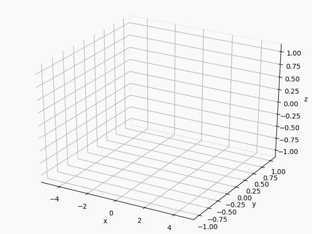

<script type="text/javascript" charset="utf-8" 
src="https://cdn.mathjax.org/mathjax/latest/MathJax.js?config=TeX-AMS-MML_HTMLorMML,
https://vincenttam.github.io/javascripts/MathJaxLocal.js"></script>

# Electromagnetismo
---

<div style="align: left; display: block">
Una parte fundamental de la electrónica y las telecomunicaciones es el electromagnetismo. Originalmente se creía que la electricidad y el magnetismo eran fenómenos aislados y no se comprendía del todo como operaban.

Con el tiempo y muchos estudios de diversos físicos, se comprendió que ambos fenómenos estaban relacionados, de hecho, que eran uno solo. 

Este descubrimiento revolucionó completamente la tecnología y abrió muchísimas puertas a nuevas ideas y desarrollos.

Para comprender a fondo el electromagnetismo, es necesario conocer herramientas matemáticas muy complejas, vamos a intentar abordar los conceptos mas importantes de este fenómeno.
</div>

<div style="align: right; display: block">

[](https://www.youtube.com/watch?v=_lrWIogPNFo)

</div>

## Algunos conceptos
---

Básicamente convivimos con ondas electromagnéticas. Todas ellas comparten algunas cualidades:

$$
c = \lambda f
$$

$$
E = cB
$$

Donde:
- $c$ : Velocidad de la luz $\big[3\times10^8\frac{m}{s}\big]$.
- $\lambda$ : Longitud de onda $[m]$.
- $f$ : Frecuencia de la onda $[Hz]$.
- $E$ : Intensidad de campo eléctrico $\big[\frac{V}{m}\big]$.
- $B$ : Densidad de flujo magnético $[Wb]$.

Ambas ecuaciones se cumplen para cualquier onda electromagnética siempre que esté viajando en el vacío.

La velocidad de la luz $c$ viene de la expresión:

$$
c = \frac{1}{\sqrt{\epsilon_0 \mu_0}}
$$

Donde:
- $\epsilon_0$ : **permitividad** eléctrica del vacío $\big[\frac{1}{36\pi}\times10^{-9}\frac{C^2}{N \times m^2}\big]$.
- $\mu_0$ : **permeabilidad** magnética del vacío $\big[4\pi \times 10^{-7} \frac{N}{A^2}\big]$.

Si todo esto se cumple cuando la onda se propaga en el vacío, falta ver que ocurre cuando la onda se propaga por algún conductor u otro medio. En esos casos, tenemos lo siguiente:

$$
v = \frac{1}{\sqrt{\epsilon}{\mu}} = \frac{c}{\sqrt{e_r \mu_r}}
$$

Como la onda no se propaga en el vacío, ahora decimos que tiene una velocidad de propagación $v$ que siempre va a ser menor que la de la luz. Luego aparecen dos nuevos factores adimensionales $\epsilon_r$ y $\mu_r$ que son la permitividad eléctrica y permeabilidad magnética relativa del medio en el que se propaga la onda.

## Ondas electromagnéticas en el espacio
---

Las ondas electromagnéticas son ondas transversales, o sea que su campo es transversal a su dirección de propagación. Pero como estas ondas en particular tienen un campo eléctrico y uno magnético que son perpendiculares entre si,necesitamos hablar de tres dimensiones para entenderlas.



En el gráfico de arriba, tenemos una onda electromagnética que tiene un campo eléctrico en el eje $z$, un campo magnético en el eje $y$ y vemos que avanza o se propaga en el eje $x$. 

Como estas ondas no son mas que senoidales, podemos expresarlas con las siguientes ecuaciones:

$$
E_z = E_{max} sin(\omega t)
$$

$$
B_y = B_{max} sin(\omega t)
$$

Donde:
- $E_{max}$ : Amplitud de la intensidad de campo eléctrico.
- $B_{max}$ : Amplitud de la densidad de flujo magnético.
- $\omega$ : Frecuencia angular $(2\pi f)$.

Noten que ponemos un subíndice que hace referencia al eje en el que varía ese campo.

## Actividad
---

Las consignas de la actividad van a encontrarla en `https://github.com/trq20/teleco1/tree/pset2/electromagnetismo`. Pueden descargarlo de ahi o clonarlo escribiendo en la terminal:

```
git clone -b pset2/electromagnetismo https://github.com/trq20/teleco1
```