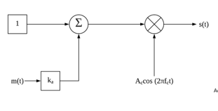

# Moduladores
---

Los moduladores son circuitos que se encargan de mezclar de alguna forma dos señales. En el caso de los circuitos moduladores de AM, la mezcla se produce de esta forma:



El mezclado puede lograrse con dispositivos como diodos o transistores (BJT, FET o MOSFET) en distintas configuraciones, pero estos dan como resultado una mezcla como estos:


Donde la portadora vale `10KHz` y la moduladora `1KHz` pero en la mezcla, no solo aparecen la moduladora, la portadora y dos frecuencias laterales, sino que además aparecen una serie de armónicos que distorsionan la señal que queremos. Por ese motivo, para obtener una AM como queríamos, estos circuitos van a tener generalmente algún tipo de filtro en la salida para rechazar las frecuencias que no nos interesan. 

La imagen de arriba es lo que llamamos un espectro de frecuencia. Sirve para analizar todas las componentes en frecuencia que tiene una señal determinada y nos va a servir para hacer algunos análisis en esta actividad.

Una de las cosas que se puede medir con este gráfico es el `ancho de banda` que es la banda de frecuencia necesaria para poder transmitir una señal, es decir, que todas las componentes de frecuencia deben poder entrar en esa banda. Vemos en el gráfico de arriba que para transmitir esa sena se necesita un ancho de banda muy grande, mientras que si logramos eliminar las componentes que no nos interesan, necesitamos uno mucho más chico.

## Actividad
---

Las consignas de la actividad junto con los circuitos que vamos a analizar van a encontrarlos en `https://github.com/trq20/teleco2/tree/pset1/moduladores`. Pueden descargarlo de ahi o clonarlo escribiendo en la terminal:

```
git clone -b pset1/moduladores https://github.com/trq20/teleco2
```

